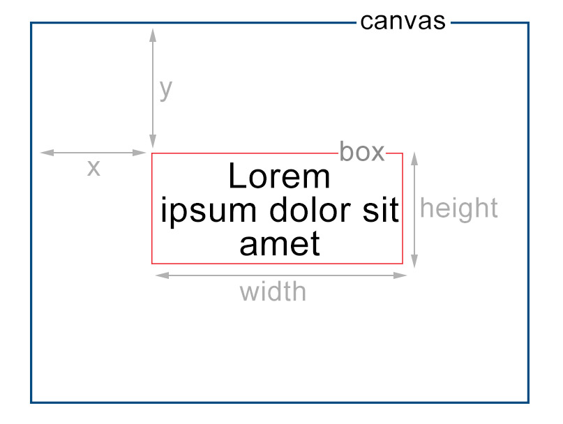

# Canvas Text


A Miniscule GWT/J2CL/Javascript library to render text on HTML5 Canvas with ZERO dependencies

The algorithm is inspired by the original TypeScript project [Canvas-Txt](https://github.com/geongeorge/Canvas-Txt).

<div align="center">

<h3>Canvas Txt 📐</h3>
<p>
Transforming Your Canvas with Multiline Magic ✨
</p>

</div>

## Features

- [x] Multiline text
- [x] Auto line breaks
- [x] Horizontal Align
- [x] Vertical Align
- [x] Justify Align
- [x] Easy Debugging
- [x] Improved Performance

## Demo

Try the library with different options from the online demo: TODO

## Usage

### GWT/J2CL

TODO


### Pure Javascript in Browser

```html
<canvas id="myCanvas" width="500" height="500"></canvas>

TODO
```

## Options



|  Properties   |   Default    | Description                                                                    |
| :-----------: | :----------: | :----------------------------------------------------------------------------- |
|    `width`    | **Required** | Width of the text box                                                          |
|   `height`    | **Required** | Height of the text box                                                         |
|      `x`      | **Required** | X position of the text box                                                     |
|      `y`      | **Required** | Y position of the text box                                                     |
|    `debug`    |   `false`    | Shows the border and align gravity for debugging purposes                      |
|    `align`    |   `center`   | Text align. Other possible values: `left`, `right`                             |
|   `vAlign`    |   `middle`   | Text vertical align. Other possible values: `top`, `bottom`                    |
|    `font`     |   `Arial`    | Font family of the text                                                        |
|  `fontSize`   |     `14`     | Font size of the text in px                                                    |
|  `fontStyle`  |     `''`     | Font style, same as css font-style. Examples: `italic`, `oblique 40deg`        |
| `fontVariant` |     `''`     | Font variant, same as css font-variant. Examples: `small-caps`, `slashed-zero` |
| `fontWeight`  |     `''`     | Font weight, same as css font-weight. Examples: `bold`, `100`                  |
| `lineHeight`  |    `null`    | Line height of the text, if set to null it tries to auto-detect the value      |
|   `justify`   |   `false`    | Justify text if `true`, it will insert spaces between words when necessary.    |

## Methods

TODO

| Method                                    | Description                                                                                                                                                                                                                     |
| :---------------------------------------- | :------------------------------------------------------------------------------------------------------------------------------------------------------------------------------------------------------------------------------ |
| `drawText(ctx,text, config)`              | To draw the text to the canvas                                                                                                                                                                                                  |
| `splitText({ ctx, text, justify, width }` | To split the text `{ ctx: CanvasRenderingContext2D, text: string, justify: boolean, width: number }`                                                                                                                            |
| `getTextHeight({ ctx, text, style })`     | To get the height of the text `{ ctx: CanvasRenderingContext2D, text: string, style: string (font style we pass to ctx.font) }` [ctx.font docs](https://developer.mozilla.org/en-US/docs/Web/API/CanvasRenderingContext2D/font) |
